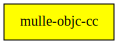

# mulle-musl

🐚 Add -static flag to musl-gcc (and mulle-clang)

When you configure musl with `-disable-shared`, there is no `libc.so` to link.
So you must compile or rather link with `-static`. And not adding `-static`
doesn't make sense. Yet **musl-gcc** doesn't set it by default.

This little script rectifies the situation.

Install where `musl-gcc` resides and use with `CC=musl-mulle-gcc`.

### You are here

